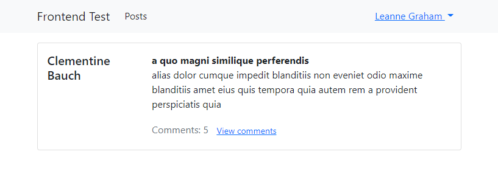

# Frontend Test

This is a simple project built with Angular v13.2.5.

There are several pages you can access:

1. Home page

   

2. Login page

   You can try login with username & password `Bret`. You can find more usable usernames [here](https://jsonplaceholder.typicode.com/users). After successful login, you will be redirected to `/posts` page.

   

3. Posts page

   In this page, posts are displayed using pagination. You can also filter posts by its title.

   

4. Detail post page

   If you click one of the post, you can view its detail.

   

   Furthermore, you can view all of its comments.

   

5. Profile page

   You can view profile of logged in user.

   

## Resources

https://jsonplaceholder.typicode.com/
